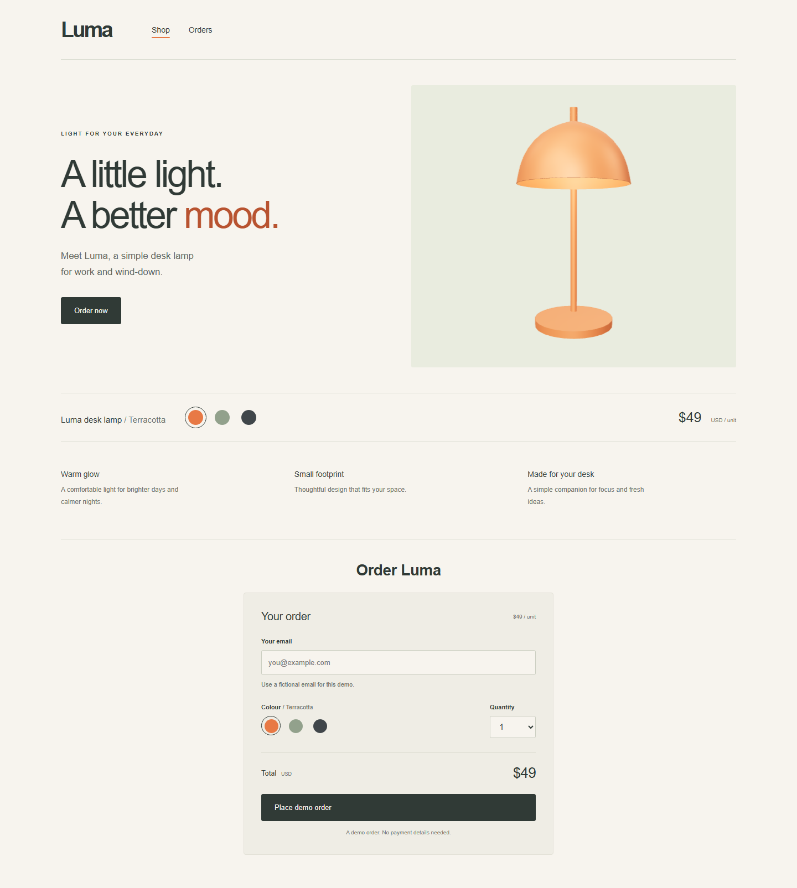
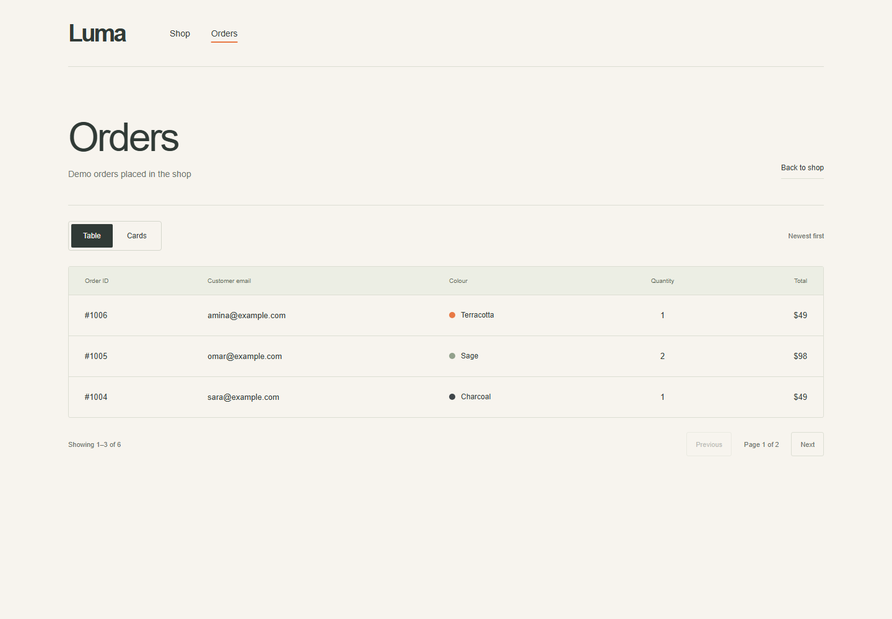
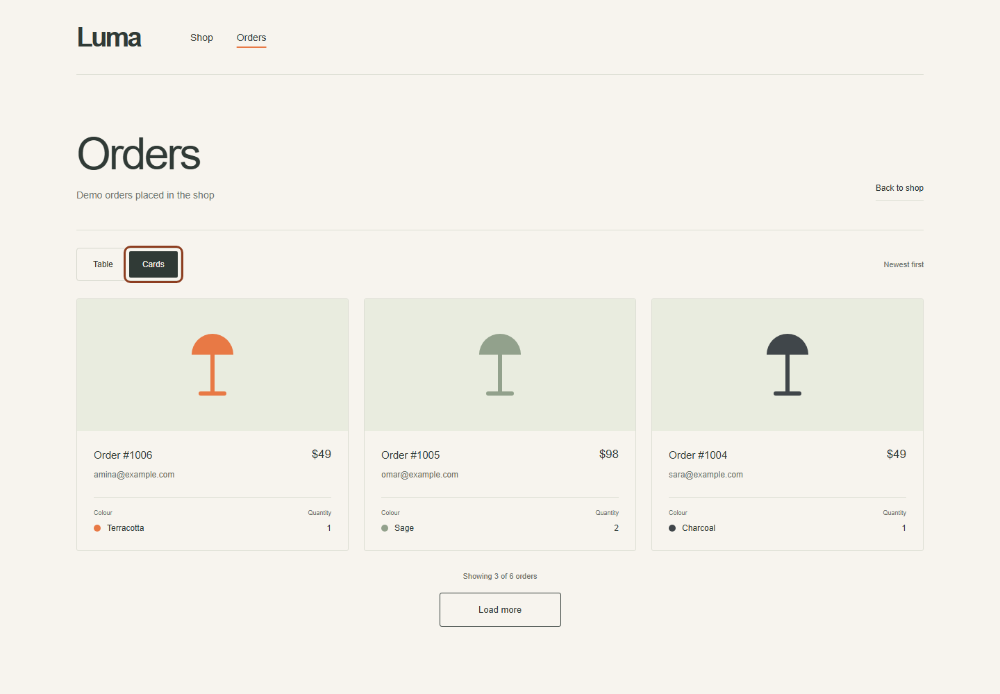

# Luma Atelier

I built Luma Atelier as a warm, minimal demo lamp shop with **Next.js App Router, React, TypeScript and a separate NestJS API**. Visitors can choose a colour and quantity, place a demo order, and browse saved orders in table or card views. The project does not process payments or provide real fulfilment.

## Start both applications

Use Node.js 22.9 or newer (tested on Node 24). In PowerShell:

```powershell
cd C:\Users\Hafida\Desktop\luma-atelier
npm install
npm run dev
```

The terminal must remain open while the application is running. The shop is available at **http://localhost:3000**. This command starts both applications:

| Application | Address |
| --- | --- |
| Shop | http://localhost:3000 |
| Orders | http://localhost:3000/orders |
| NestJS product endpoint | http://localhost:3001/api/products |

The applications can also be started separately with `npm run dev:api` and `npm run dev:web`. Ctrl+C stops the servers. If a port is occupied, the previous Luma process must be stopped first. The product endpoint above provides a quick way to confirm that the API is running.

Production build and local run:

```sh
npm run build
npm start
```

## Screenshots







Mobile: [shop](docs/screenshots/shop-mobile.png), [orders](docs/screenshots/orders-mobile.png). The screenshot test waits for the Three.js canvas to report that the GLB is ready before capturing both shop layouts, so these screenshots show the rendered 3D lamp rather than the loading spinner. The orders screenshots use fictional seed data.

## Environment

No environment files are required for the defaults. Copy the corresponding `.env.example` to customize:

| File | Variable | Default |
| --- | --- | --- |
| `apps/api/.env` | `PORT` | `3001` |
| `apps/api/.env` | `FRONTEND_ORIGIN` | Both `http://localhost:3000` and `http://127.0.0.1:3000`; an explicit value overrides these |
| `apps/api/.env` | `DATA_DIR` | `apps/api/data`, independent of working directory; use an absolute custom path |
| `apps/web/.env.local` | `NEXT_PUBLIC_API_URL` | `http://localhost:3001/api` |

Restart after changes. The frontend API URL is public and included at build time, so rebuild for production after changing it. Both servers bind to the local machine.

## Architecture

```text
apps/
  api/src/
    products/           Product endpoint and catalogue service
    orders/             Order endpoints and business rules
      dto/              Input validation
    storage/            Seeds, queued writes and atomic publication
    app.ts              CORS, validation pipe, error filter
  web/src/
    app/                Next.js routes, layout and CSS
    components/
      lamp.tsx          SVG fallback for a failed 3D viewer
      product-lamp.tsx   Client-only lazy loading and error boundary
      three-lamp.tsx     Three.js GLB viewer, materials and lighting
      shop.tsx          Product fetch, colour selection
      order-form.tsx    Validation and submission state
      orders/           Table, cards, flat card icons and pagination hook
    lib/                API client, types and display helpers
tests/                  Browser and real API integration checks
```

The browser calls NestJS directly. There are no Next.js API routes or database. Controllers handle HTTP; services handle business rules. One Nest module keeps this small demo easy to follow. Frontend interfaces mirror the HTTP contract without importing backend runtime code.

`class-validator` and `class-transformer` support Nest DTO validation and email trimming without coercing quantities. `concurrently` runs both apps and compiler watchers on Windows and other platforms. Development explicitly uses Webpack after a Turbopack development-process crash on this Windows environment; production builds retain Next's default bundler. Playwright exercises a production build in Chromium; backend tests use Node's test runner. Motion uses CSS transitions/keyframes and needs no additional library.

## Behaviour

I set the initial configuration to terracotta and quantity 1. Both sets of colour buttons share the selection, label and lamp colour. Quantity uses a native select limited to 1–5, and totals update immediately. Order now scrolls to the form. The form models idle, validating, saving, success and failure. A synchronous ref prevents overlapping submissions; inputs and the submit button are disabled during saving. A failure preserves the entered values, while success shows the server-generated ID and a link to Orders.

The API client uses `cache: 'no-store'`, cancellation and a 15-second timeout. Visiting Orders fetches page 1 again. I use `AbortController` and a generation counter in the orders hook to reject stale responses. Switching views resets data to page 1. The table requests only the chosen page. Cards initially request page 1, append one page per click, deduplicate IDs and retain existing cards after an error. The page advances only after a successful response, and Retry requests the same failed page. Initial loading, empty results, initial errors and pagination failures have distinct states.

## API contract

| Endpoint | Response |
| --- | --- |
| `GET /api/products` | `200` array containing Luma and its colours |
| `POST /api/orders` | `201` complete persisted order |
| `GET /api/orders?page=1` | `200` `{ items, total, page, pageSize: 3 }` |

Order request:

```json
{ "productId": "luma", "email": "amina@example.com", "colour": "terracotta", "quantity": 2 }
```

Example created order:

```json
{
  "id": 1007,
  "productId": "luma",
  "email": "amina@example.com",
  "colour": "terracotta",
  "quantity": 2,
  "unitPriceCents": 4900,
  "totalCents": 9800,
  "createdAt": "2026-09-09T12:00:00.000Z"
}
```

The backend trims/validates email and requires a known product, an available colour and an integer quantity 1–5. Repeated emails are allowed. Extra fields are stripped; price is read from the product file and total is calculated server-side. Invalid requests return `400` with `{ "error": "message" }`; storage failures return `500` with a safe message and server logging.

Page defaults to 1. Positive decimal integer strings are accepted; negative numbers, fractions, leading zeroes, unsafe integers and repeated page parameters are rejected. Page size is always 3. Beyond-the-end pages return empty items. Orders sort by timestamp descending, then numeric ID descending.

## JSON storage and reset

First startup creates missing `products.json` and `orders.json`. Luma costs 4900 cents USD and includes terracotta `#E87945`, sage `#92A18C` and charcoal `#40464A`, with labels. Six fictional orders (#1001–#1006) create two table pages; #1006 is newest. Existing files survive restarts; corrupt files are never silently replaced. Runtime data is ignored by Git; seeds in `apps/api/src/storage/seeds.ts` are versioned.

The storage service queues the **entire read-modify-write operation**, including ID generation above the highest persisted ID. It writes a unique temporary file next to the destination, then renames it over the original. Only then does POST succeed. Rejected operations do not block later writes. Readers see complete old or new JSON.

To reset the demo data, I stop the API, optionally back up the existing orders, delete only `products.json` and `orders.json` inside the configured data directory, and restart the API. This intentionally discards demo orders. I did not expose a reset endpoint.

## Verification

```sh
npm test
npx playwright install chromium
npm run test:e2e
npm run build
```

Backend tests cover validation, seeded and malformed pages, ignored client prices, $98 totals, persisted success, twelve concurrent orders, restart persistence, timestamp ties and storage failure recovery. The intentional corruption test logs a server error while passing.

Browser tests cover colour/total changes, submission states and retry, pagination, lazy cards, same-page retry, fresh navigation, stale responses, empty/product errors, mobile overflow, keyboard operation and reduced motion. Mocked responses reproduce errors deterministically. A separate integration test submits through the UI to real NestJS and verifies the JSON and first table row; only the API port is redirected to an isolated server. Tests use temporary storage and never reset the project's demo data. The responsive test refreshes the screenshots after the 3D canvas reports that the model is ready.

My manual acceptance flow is to navigate with Tab and Enter, select sage and quantity 2, place a fictional order, confirm the $98 total and its ID above #1006, switch views, load more, and check the mobile layouts. I also stop the API to inspect error states, then restart and retry to verify persistence.

## Accessibility and creative decisions

Cream, terracotta, sage and charcoal create a quiet editorial design with system fonts, subtle borders and generous spacing. The interface follows the PDF reference with simple text, product visuals and functional controls. Extra slogans, decorative symbols and the ambient toggle have been removed.

I implemented the optional 3D bonus with **Three.js** and the supplied model at `apps/web/public/assets/Lampa.glb`, served as `/assets/Lampa.glb`. The original asset is preserved. The viewer hides the oversized `Plane` at runtime and frames the lamp automatically. Only `LampColor` on the `Base` object is recoloured. `GLTFLoader` retains the `Bulb` material on `Bola`, including its `KHR_materials_emissive_strength` value. I added a warm point light because an emissive material does not illuminate nearby meshes by itself in this renderer. The viewer does not use bloom postprocessing.

I load the viewer in a separate client-only bundle. It renders on interaction, resize and colour changes rather than running a continuous animation loop. The canvas supports dragging and all four arrow keys. Horizontal rotation is limited to ±60°, and the polar angle is limited to 55–95° (35° above to 5° below horizontal). Zoom and pan are disabled, while vertical touch gestures can still scroll the page. Pixel ratio is capped at 2. Geometry, materials, textures, controls and the renderer are disposed on unmount. A small spinner appears while the viewer code and model load; reduced-motion preferences disable its rotation. If the model or WebGL fails, the colour-responsive SVG fallback appears so ordering never depends on 3D. Order-card thumbnails use only three flat SVG shapes in the selected colour, without shading or decorative details. I did not add React Three Fiber because this single viewer does not need its additional abstraction.

Browser tests cover model loading, visible colour changes, keyboard rotation, a missing model and WebGL context loss. [3D screenshot](docs/screenshots/lamp-3d.png).

Semantic landmarks, a skip link, labelled inputs, native buttons/selects, pressed states, live feedback, visible keyboard focus and a captioned table support accessible use. Mobile cards stack; only the table container scrolls horizontally. Reduced motion disables animation and smooth scrolling. Automated checks cover keyboard and layout; a full manual screen-reader audit remains outside the completed verification.

## Limitations and submission notes

This is a local single-process demo for fictional data, without authentication, payments, deployment or multiprocess locking. Atomic replacement does not guarantee power-loss durability. Offset pages can shift when other orders arrive; cards deduplicate IDs and revisiting refreshes the list. A timed-out POST may have reached the server, so the Orders page should be checked before retrying an ambiguous timeout. Server-side idempotency is outside the required contract.

I used a root dependency override to pin Nest's transitive Multer dependency to patched version 2.3.0. I updated the lockfile with a workspace-local npm 12 because npm 11.12 ignored overrides across workspace links ([upstream issue](https://github.com/npm/cli/issues/9659)). This did not change the global npm installation. The final dependency audit reported zero vulnerabilities; advisory data may change, so I will run `npm audit` again before submission.

On npm 11.12, `npm ls` can incorrectly flag the overridden version as invalid because of the same workspace bug. I verified that the standard `npm install` retains 2.3.0 and reports zero audit findings. I use an updated npm when intentionally changing dependency overrides.

The 3D bonus uses the supplied GLB. The required shop and API functionality, setup instructions and screenshots are included. I did not deploy the application.

Time spent: not accurately tracked; but I would say about 18 hours in total.

AI assistance: Codex assisted with implementation, debugging, documentation and tests. I reviewed the components, pagination hook and storage queue.
